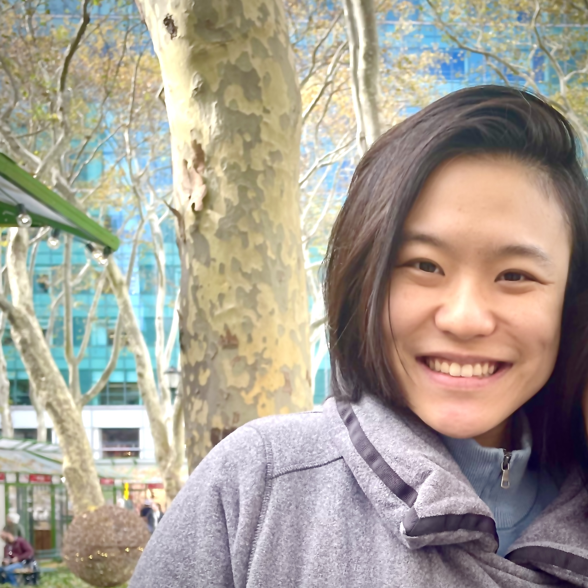

Hello! I manage the [WE-search Lab](https://www.ashwinia.com/about) at New York University. 

I am interested in how people use verbal **narratives** to transmit **causal knowledge** in society. I ask questions such as:
- Social phenomena like intergroup conflicts and inequality result from highly complex causal relations. How do people compress them into compact narratives? 
- What makes some narratives more popular than others? Why do some types of causal relations get included more than others?
- How do goals shape the narratives people tell and hear? 
- How do narratives co-evolve with culture and technology? 
- How do narratives affect people's downstream attitude and behavior? 

I try to answer these questions using a variety of methods, including behavioral experiments, computational models, and natural language processing. 

I graduated *summa cum laude* from Georgetown University and *cum laude* from Phillips Academy. Outside of the lab, I enjoy long walks, old books, live music, and (almost) everything in nature.

You can reach me at lin.v.gan \<at\> gmail \<dot\> com and on [Bluesky](https://bsky.app/profile/lingan.bsky.social). 

